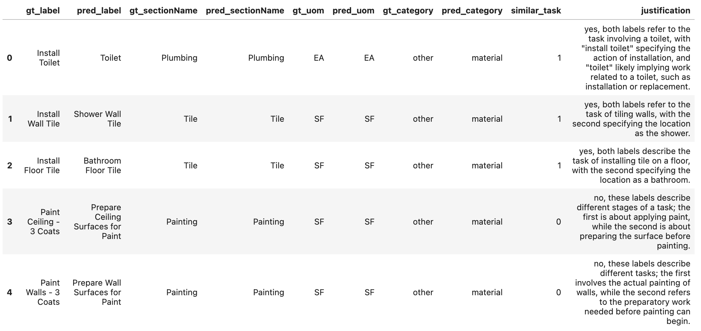
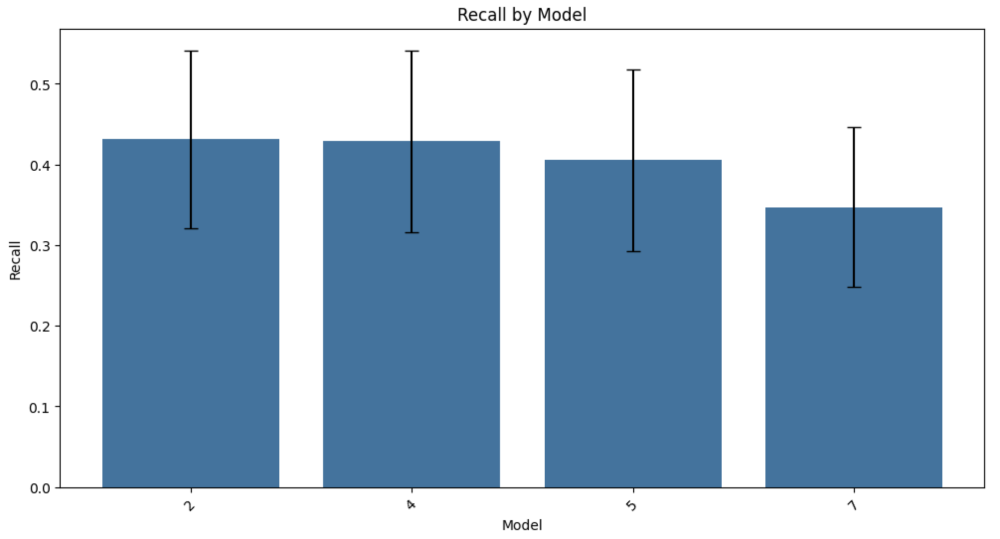
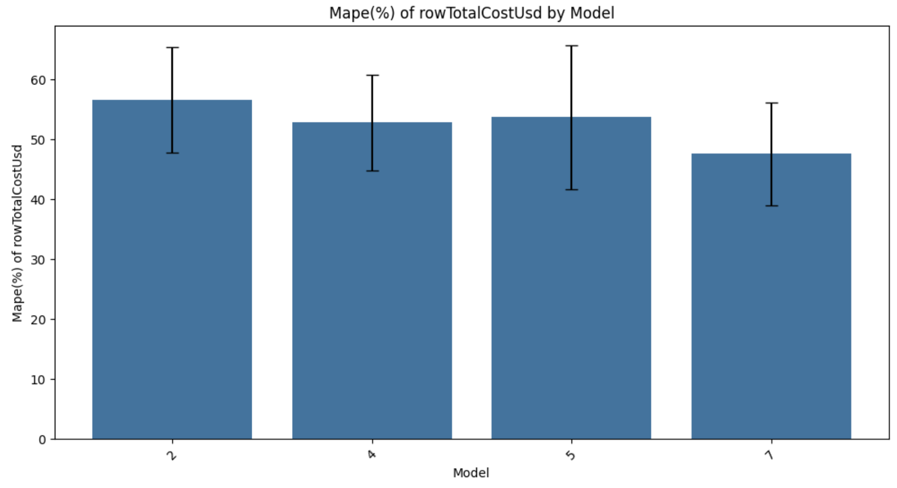
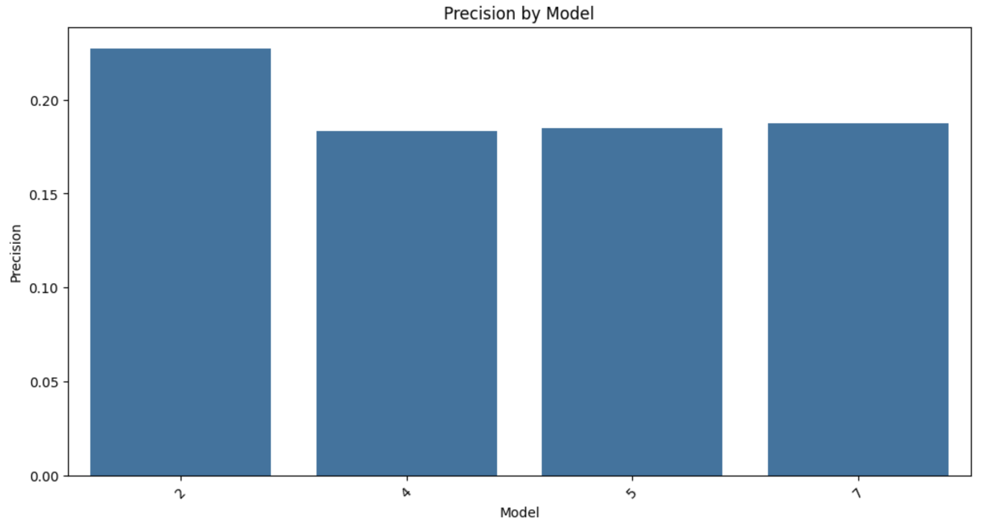
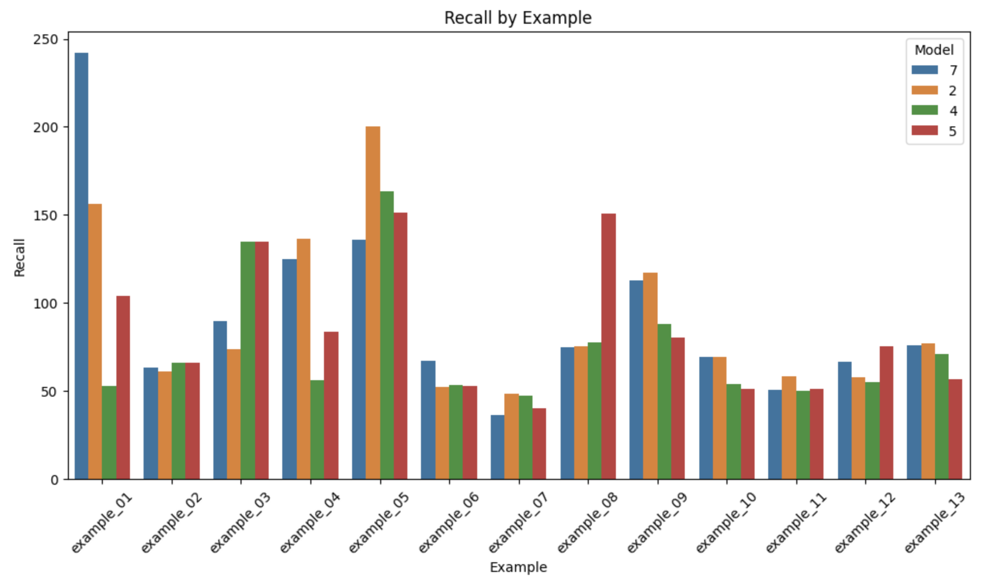
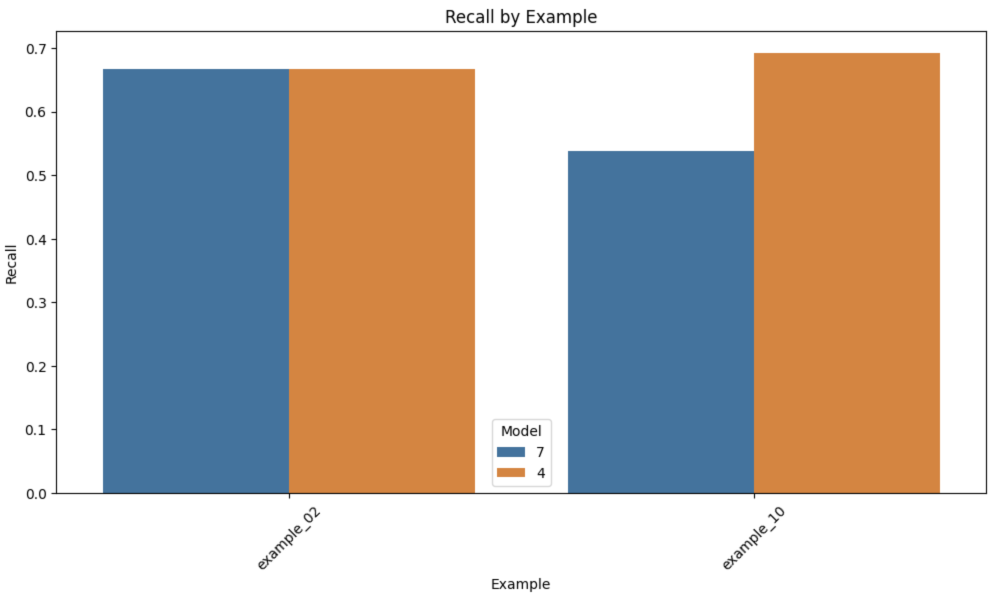
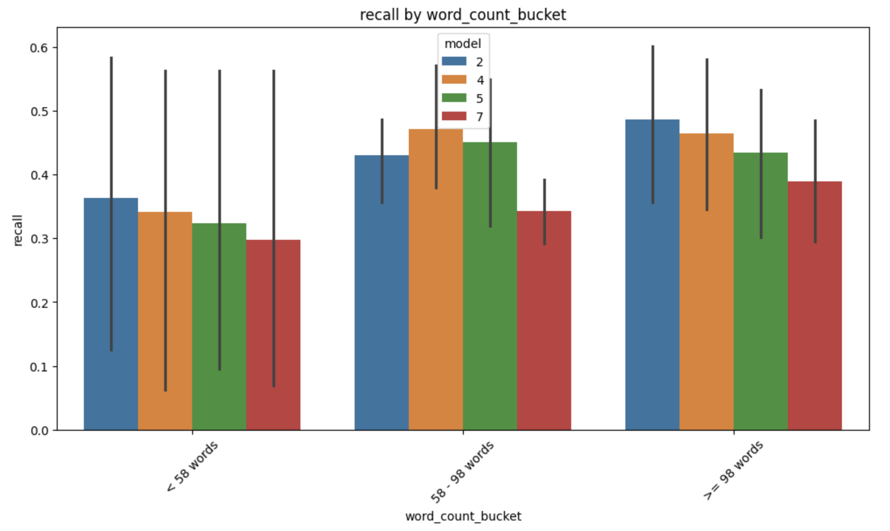

# handoff-eval
**Handoff** evaluation framework

## **Table of Contents**
- [Installation Guide](#installation-guide)
  - [Using `handoff-eval` as a Library](#using-handoff-eval-as-a-library)
  - [Developing & Testing `handoff-eval`](#developing--testing-handoff-eval)
- [Setting Up Data Folder](#setting-up-data-folder)
- [Evaluation Framework](#evaluation-framework)
- [Run the Validation Framework](#run-the-validation-framework)
  - [Generate the Validation Data](#generate-the-validation-data)
  - [Identify the Best Models](#identify-the-best-models)
  - [Investigate More Deeply](#investigate-more-deeply)

---

## Installation Guide

### Using `handoff-eval` as a Library

If you only need to **use** `handoff-eval` in a project, follow these steps:

Run the following command to create and activate a virtual environment:
```bash
python3 -m venv .venv
source .venv/bin/activate  # On macOS/Linux
```
(For Windows users, use `.\.venv\Scripts\activate` instead of `source .venv/bin/activate`.)

Now, install the library from GitHub:
```bash
pip install git+https://github.com/krzischp/handoff-eval.git
```

Create a `.env` file in your project's root directory to store environment variables:
```bash
touch .env
```

Then, open .env in a text editor and add the following:
```ini
OPENAI_API_KEY=your-api-key-here
OPENAI_MODEL=gpt-4-turbo  # Change this to the model you prefer
```

Your environment is now ready to use handoff-eval!

Install jupyter (for running notebooks) and `python-dotenv` (for environment variables):
```bash
pip install jupyter==1.1.1 python-dotenv==1.0.1
```

Read the env variables before to use `handoff_eval`
```python
from dotenv import load_dotenv, find_dotenv

_ = load_dotenv(find_dotenv())  # read local .env file
```

### Developing & Testing handoff-eval
If you want to modify and test the library, follow these steps:
```bash
git clone https://github.com/krzischp/handoff-eval.git
cd handoff-eval
```

Set up a virtual environment and use `make init` to install all required dependencies, including `handoff-eval` in editable mode:
```bash
python3 -m venv .venv
source .venv/bin/activate  # On macOS/Linux
make init
```

Run the test suite to ensure everything works:
```bash
make test
```
Before committing changes, run:
```bash
make format  # Auto-format with Black
make lint    # Check code style with Flake8
```

To run notebooks inside the virtual environment:
```bash
make notebook
```

If new dependencies are added to requirements.txt or requirements-dev.txt, run:
```bash
make sync
```

## Setting Up Data Folder
Before running `handoff-eval`, create a `data/` directory and organize your input files in the following format:

```
├── data
│   ├── ai_ml_take_home  # Example subfolder for a dataset
│   │   ├── ground_truth
│   │   │   ├── example_01.json
│   │   │   ├── example_02.json
│   │   │   ├── example_03.json
│   │   │   ├── ...
│   │   └── model_outputs
│   │       ├── 2.json
│   │       ├── 4.json
│   │       ├── 5.json
│   │       └── 7.json
```

- The name `ai_ml_take_home` is an example, but each dataset should have its own subfolder.
- The **ground_truth** folder contains labeled examples.
- The **model_outputs** folder stores the AI-generated results.

#### **Ground Truth Data**
The `ground_truth/` folder contains JSON files (`example_n.json`) with the following structure:

```json
{
  "test_n": 1,
  "input": "Detailed description of the project and requirements",
  "rows": [
    {
      "item": "Task description",
      "quantity": 10,
      "unit_price_usd": 15.5,
      "subtotal_usd": 155.0
    }
  ],
  "totalCostUsd": 155.0
}
```
- `test_n`: Integer representing the test case number.
- `input`: String describing the **project details and requirements**.
- `rows`: Array of objects, each representing a line item in the estimate.
- `totalCostUsd`: Number representing the total project cost in USD.

---

#### **Model Output Data**
The `model_outputs/` folder contains JSON files (`n.json`), each storing model-generated estimates:

```json
{
  "estimate_preds": [
    {
      "valid_file_name": "example_01.json",
      "rows": [
        {
          "item": "Generated task",
          "quantity": 10,
          "unit_price_usd": 15.5,
          "subtotal_usd": 155.0
        }
      ],
      "time_to_estimate_sec": 3.45
    }
  ]
}
```
- `estimate_preds`: Array of model outputs.
  - `valid_file_name`: The corresponding ground truth file (`example_n.json`) used as input.
  - `rows`: Generated line-item estimates (same format as in the ground truth data).
  - `time_to_estimate_sec`: Time taken to generate the estimate (in seconds).

---

## Evaluation Framework

**For Estimate Line Items vs Ground Truth (GT) Line Items**

| **Step**        | **Objective** | **Key Variables** | **Methodology** | **Why This Approach?** |
|----------------|--------------|-------------------|----------------|----------------------|
| **Step 1: Identify Tasks (Retrieval)** | Ensure the model understands what needs to be done | `sectionName`, `label`, `uom`, `category` (string variables) | - 1. Use **fuzzy matching** on categorical fields (cost drivers) and **Jaccard index**\* on `label` to match ground truth line items to their estimates <br> - 2. **LLM validation**: prune matched items that are unrelated according to the labels understanding. <br> - **Evaluation metrics**: Use **Recall** (%of gt items retrieved) and **Precision** (%of estimates that are gt items)| - **Fuzzy match** is reliable for structured fields: **categorical fields** have high match rates (domain-specific) <br> - We also use **Jaccard index** on the labels to differentiate the tasks better <br> - We use an accurate **LLM** (gpt-4) to do the final check based on labels correspondance|
| **Step 2: Quantify Tasks (Estimation)** | Measure how well the model estimates quantities | `qty`, `rateUsd`, `rowTotalCostUsd` (numerical variables) | - **Check residual errors** only for correctly matched tasks <br> - **Evaluation metric**: Use **Mean Absolute Percentage Error (MAPE)** | - If the task is not identified correctly (step 1), numerical estimates are **untrustworthy** <br> - **Low recall = no MAPE measurement** (not confident) |

\* [Jaccard index](https://en.wikipedia.org/wiki/Jaccard_index) to compare labels (group of words)


---

**Step 1 - Example**

- Ground truth (`gt_`) and estimate (`pred_`) items are matched based on **Fuzzy match** of structured fields, and **Jaccard index** of labels
- We then use the **LLM** (gpt-4) to identify related tasks based on the label understanding
    - `similar_task` is 1 if gt and estimate labels correspond to related task
    - `justification` is a quick text explaining why (for debugging purpose)




## Run the validation framework

For a complete example of how to use `handoff-eval`, check out the [evaluation notebook](https://github.com/krzischp/handoff-eval/blob/main/notebooks/evaluation.ipynb).

### Generate the validation data

Executing step 1 and step 2 of the methodology to generate our evaluation data.

```python
import handoff_eval

async def run_async_processing():
    return await handoff_eval.data_preparation.process_all_models_async(model_output_data, ground_truth_data)

matched_pairs_dict = await run_async_processing()

# Save the dictionary to a pickle file
with open(eval_file_path, "wb") as f:
    pickle.dump(matched_pairs_dict, f)
```


### Identify the best models

**Recall** and **MAPE of `rowTotalCostUsd`** are the main KPIs. Here we can identify the model "4" as the best performer.

```python
confidence=0.95
x = "model"
error_type = "recall"
df_metrics = handoff_eval.evaluation.compute_model_metrics_df(matched_pairs_dict, metric=None, error_type=error_type)
handoff_eval.evaluation.plot_model_metrics(df_metrics, x=x, metric_name=error_type.capitalize(), confidence=confidence)
```



```python
metric = "rowTotalCostUsd"
error_type = "mape"
df_metrics = handoff_eval.evaluation.compute_model_metrics_df(matched_pairs_dict, metric=metric, error_type=error_type)
handoff_eval.evaluation.plot_model_metrics(df_metrics, x=x, metric_name=error_type.capitalize(), confidence=confidence)
```


**Precision** is also an important metric. Low precision means the model has lot of estimates not corresponding to actual tasks and therefore it is more likely to overestimate the final cost.

```python
error_type = "precision"
df_metrics = handoff_eval.evaluation.compute_model_metrics_df(matched_pairs_dict, metric=None, error_type=error_type)
handoff_eval.evaluation.plot_model_metrics(df_metrics, x=x, metric_name=error_type.capitalize(), confidence=confidence)
```



---

### Investigate more deeply


#### Performances for specific components of the total cost

We can investigate the MAPE of the components of the total cost: `qty` and `rateUsd`:
```python
metric = "qty"
error_type = "mape"
df_metrics = handoff_eval.evaluation.compute_model_metrics_df(matched_pairs_dict, metric=metric, error_type=error_type)
handoff_eval.evaluation.plot_model_metrics(df_metrics, x=x, metric_name=error_type.capitalize(), confidence=confidence)
```

```python
metric = "rateUsd"
error_type = "mape"
df_metrics = handoff_eval.evaluation.compute_model_metrics_df(matched_pairs_dict, metric=metric, error_type=error_type)
handoff_eval.evaluation.plot_model_metrics(df_metrics, x=x, metric_name=error_type.capitalize(), confidence=confidence)
```


#### Performance by example

We can also try to spot the problematic examples for each of our model:

```python
x = "example"
error_type = "recall"
df_metrics = handoff_eval.evaluation.compute_model_metrics_df(matched_pairs_dict, metric=None, error_type=error_type)
handoff_eval.evaluation.plot_model_metrics(df_metrics, x=x, metric_name=error_type.capitalize())
```



We can also filter models and examples in the plot. For e.g., we might want to compare the best and worst models on specific examples:
```python
x = "example"
error_type = "recall"
filtered_df = handoff_eval.evaluation.filter_metrics(df_metrics, example_list=["example_02", "example_10"], model_list=["4", "7"])
handoff_eval.evaluation.plot_model_metrics(filtered_df, x=x, metric_name=error_type.capitalize())
```


You can then investigate the input of the specific example `example_02` where both models are performing well
```python
data_path = "../data/ai_ml_take_home"
ground_truth_path = os.path.join(data_path, "ground_truth")
ground_truth_data = handoff_eval.data_preparation.load_json_files(ground_truth_path)

print(ground_truth_data["example_02"]["input"])
> "I have a utility room which needs sound insulation and drywall on one wall. I would like this wall painted also. Wall is 20'x10'."
```
Here the input is very simple with very few needs.

#### Performance by input metadata

We can implement functions to extract metadata from the input, and plot the performances using `plot_metric_by_metadata`

```python
bucket_edges = handoff_eval.utils.compute_word_count_buckets(ground_truth_data, n_buckets=3)

df_metrics_with_metadata = handoff_eval.evaluation.add_metadata_to_metrics(
    df_metrics, ground_truth_data, lambda x: handoff_eval.utils.bucketize_word_count(x, bucket_edges), "word_count_bucket"
)
df_metrics_with_metadata = handoff_eval.utils.sort_buckets(df_metrics_with_metadata, "word_count_bucket", bucket_edges)
handoff_eval.evaluation.plot_metric_by_metadata(df_metrics_with_metadata, error_type="recall", x_column="word_count_bucket", hue_column="model")
```


For e.g., here can observe that inputs with more tokens have a higher recall in average. This can be due to more context provided to the llm to better identify the items.
