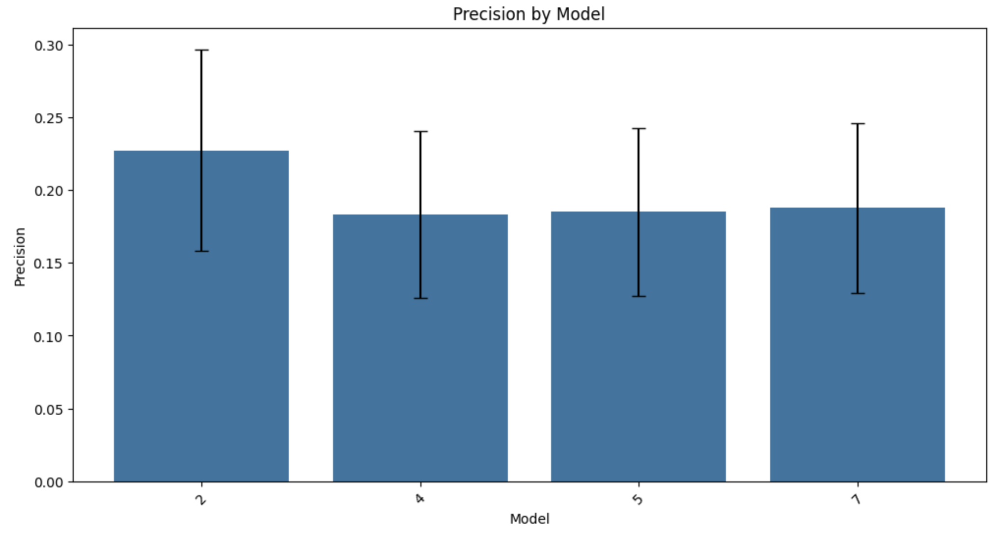

# handoff-eval
**Handoff** evaluation framework

## **Table of Contents**
- [Installation Guide](#installation-guide)
  - [Using `handoff-eval` as a Library](#using-handoff-eval-as-a-library)
  - [Developing & Testing `handoff-eval`](#developing--testing-handoff-eval)
- [Evaluation Framework](#evaluation-framework)
- [Run the Validation Framework](#run-the-validation-framework)
  - [Generate the Validation Data](#generate-the-validation-data)
  - [Identify the Best Models](#identify-the-best-models)
  - [Investigate More Deeply](#investigate-more-deeply)

---

## Installation Guide

### Using `handoff-eval` as a Library

If you only need to **use** `handoff-eval` in a project, follow these steps:

Run the following command to create and activate a virtual environment:
```bash
python3 -m venv .venv
source .venv/bin/activate  # On macOS/Linux
```
(For Windows users, use `.\.venv\Scripts\activate` instead of `source .venv/bin/activate`.)

Now, install the library from GitHub:
```bash
pip install git+https://github.com/krzischp/handoff-eval.git
```

Your environment is now ready to use handoff-eval!

Install jupyter (for running notebooks) and `python-dotenv` (for environment variables):
```bash
pip install jupyter==1.1.1 python-dotenv==1.0.1
```

### Developing & Testing handoff-eval
If you want to modify and test the library, follow these steps:
```bash
git clone https://github.com/krzischp/handoff-eval.git
cd handoff-eval
```

Set up a virtual environment and use `make init` to install all required dependencies, including `handoff-eval` in editable mode:
```bash
python3 -m venv .venv
source .venv/bin/activate  # On macOS/Linux
make init
```

Run the test suite to ensure everything works:
```bash
make test
```
Before committing changes, run:
```bash
make format  # Auto-format with Black
make lint    # Check code style with Flake8
```

To run notebooks inside the virtual environment:
```bash
make notebook
```

If new dependencies are added to requirements.txt or requirements-dev.txt, run:
```bash
make sync
```

## Evaluation Framework

**For Estimate Line Items vs Ground Truth (GT) Line Items**

| **Step**        | **Objective** | **Key Variables** | **Methodology** | **Why This Approach?** |
|----------------|--------------|-------------------|----------------|----------------------|
| **Step 1: Identify Tasks (Retrieval)** | Ensure the model understands what needs to be done | `sectionName`, `label`, `uom`, `category` (string variables) | - 1. Use **fuzzy matching** on categorical fields (cost drivers) and **Jaccard index**\* on `label` to match ground truth line items to their estimates <br> - 2. **LLM validation**: prune matched items that are unrelated according to the labels understanding. <br> - **Evaluation metrics**: Use **Recall** (%of gt items retrieved) and **Precision** (%of estimates that are gt items)| - **Fuzzy match** is reliable for structured fields: **categorical fields** have high match rates (domain-specific) <br> - We also use **Jaccard index** on the labels to differentiate the tasks better <br> - We use an accurate **LLM** (gpt-4) to do the final check based on labels correspondance|
| **Step 2: Quantify Tasks (Estimation)** | Measure how well the model estimates quantities | `qty`, `rateUsd`, `rowTotalCostUsd` (numerical variables) | - **Check residual errors** only for correctly matched tasks <br> - **Evaluation metric**: Use **Mean Absolute Percentage Error (MAPE)** | - If the task is not identified correctly (step 1), numerical estimates are **untrustworthy** <br> - **Low recall = no MAPE measurement** (not confident) |

\* [Jaccard index](https://en.wikipedia.org/wiki/Jaccard_index) to compare labels (group of words)


---

**Step 1 - Example**

- Ground truth (`gt_`) and estimate (`pred_`) items are matched based on **Fuzzy match** of structured fields, and **Jaccard index** of labels
- We then use the **LLM** (gpt-4) to identify related tasks based on the label understanding
    - `similar_task` is 1 if gt and estimate labels correspond to related task
    - `justification` is a quick text explaining why (for debugging purpose)


## Run the validation framework

### Generate the validation data

Executing step 1 and step 2 of the methodology to generate our evaluation data.

```python
import handoff_eval

async def run_async_processing():
    return await handoff_eval.data_preparation.process_all_models_async(model_output_data, ground_truth_data)

matched_pairs_dict = await run_async_processing()

# Save the dictionary to a pickle file
with open(eval_file_path, "wb") as f:
    pickle.dump(matched_pairs_dict, f)
```


### Identify the best models

**Recall** and **MAPE of `rowTotalCostUsd`** are the main KPIs. Here we can identify the model "4" as the best performer.

```python
x = "model"
error_type = "recall"
df_metrics = handoff_eval.evaluation.compute_model_metrics_df(matched_pairs_dict, metric=None, error_type=error_type)
handoff_eval.evaluation.plot_model_metrics(df_metrics, x=x, metric_name=error_type.capitalize())
```


```python
metric = "rowTotalCostUsd"
error_type = "mape"
df_metrics = handoff_eval.evaluation.compute_model_metrics_df(matched_pairs_dict, metric=metric, error_type=error_type)
handoff_eval.evaluation.plot_model_metrics(df_metrics, x=x, metric_name=error_type.capitalize())
```


**Precision** is also an important metric. Low precision means the model has lot of estimates not corresponding to actual tasks and therefore it is more likely to overestimate the final cost.

```python
error_type = "precision"
df_metrics = handoff_eval.evaluation.compute_model_metrics_df(matched_pairs_dict, metric=None, error_type=error_type)
handoff_eval.evaluation.plot_model_metrics(df_metrics, x=x, metric_name=error_type.capitalize())
```



---

### Investigate more deeply

We can also try to spot the problematic examples for each of our model:

